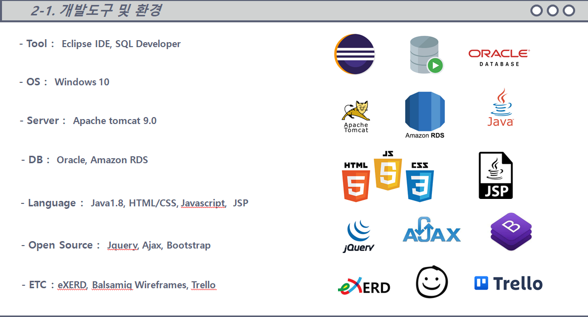
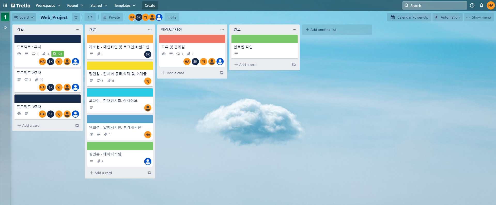
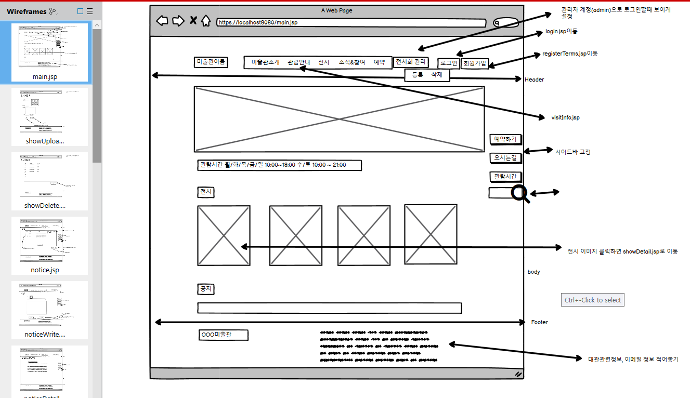
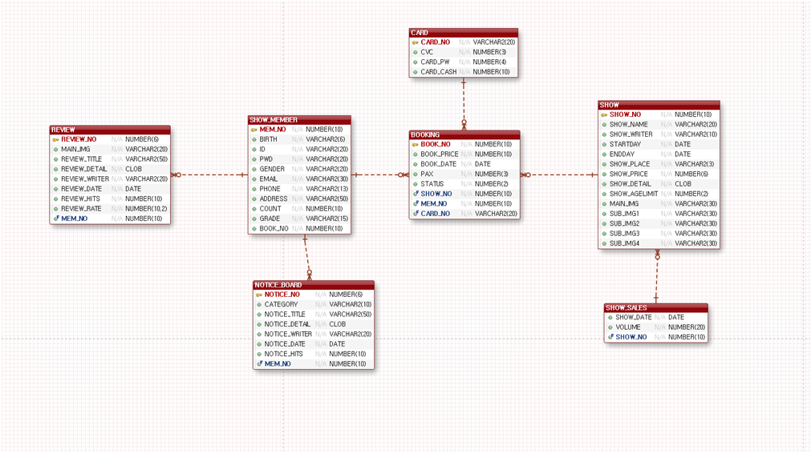
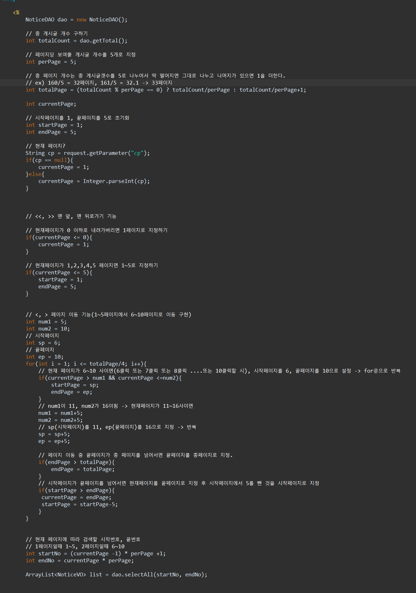
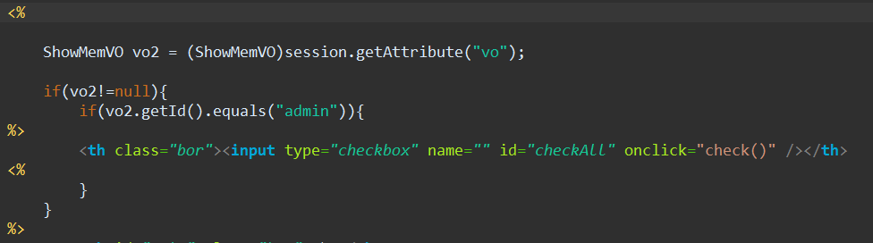

# Web Project(중아미술관)

- 학원에서 진행한 2차 프로젝트
- 전시회를 예약할 수 있는 미술관 웹사이트 제작
- 팀원은 총 5명이였고 파트를 5개로 나누어 분할작업을 실시했다.
- 백과 프론트를 나누지 않고 서버 프로그래밍과 디자인 둘 다 해볼수 있도록 역할을 나누었다.(각자 맡은 페이지의 디자인은 스스로 해봄)
- Model1 방식으로 개발함

# 개발도구 및 환경
 
 
 

- 소규모 프로젝트에서 문서 관리툴은 Trello가 좋다는 멘토님 말을 듣고 이번 기회에 사용해보고 싶어서 조원들에게 한번 써보자고 제안을 했었는데 다들 좋다고 했다. <https://trello.com/b/Ce9b7y5G/webproject>
- UI설계는 화면공유를 통해 다같이 상의하면서 작성했다.
- 정규화를 통해 ERD를 작성하였으며 처음 해보는 정규화 작업이라 어려웠고 만족스럽게 만들지 못했다.

# 개발일정
|기간|작업내용|
|----|--------|
|10월28일~30일|주제선정 및 요구분석|
|11월 1일~3일| UI및 DB설계|
|11월 4일~13일| 웹 프로그래밍 진행|
|11월 15일~17일| 발표준비|
|11월 18일|발표|

- 프로젝트는 총 3주간의 기간에 걸쳐 진행되었다.

# 조원 및 분담
|조원|역할|
|---|----|
|김민준(조장)|전시회 예약, 조회, 취소|
|안희선(부조장)|알림게시판, 후기게시판|
|고다정|전시회 목록 조회, 전시회 상세정보 페이지|
|계소현|메인화면, 로그인 및 회원가입|
|정연일|전시회 등록 및 삭제, 기타 페이지|

# 내가 맡은 역할
- 게시판을 직접 구현해보고 싶어서 게시판 부분을 맡겠다고 했다.
- 관리자가 공지글을 작성할 수 있는 알림게시판과 관람객이 감상한 전시회의 관람평을 작성할 수 있는 후기게시판을 작성했다.
- 관리자 계정(admin)으로 로그인 시 할 수 있는 기능과, 고객 계정으로 로그인 시 할 수 있는 기능을 분리했다.
- 게시판 디자인은 국립중앙박물관의 게시판 디자인을 참고해서 디자인했다. <https://www.museum.go.kr/site/main/archive/united/category/128>

## 알림게시판

### 페이징처리와 게시글 클릭시 상세내용을 볼 수 있게 구현했다.

### 관리자계정으로 로그인 시 공지글을 작성 및 삭제할 수 있다. (버튼이 생성됨)

## 후기게시판

### 고객이 관람한 전시회만 관람평을 쓸 수 있고, ajax를 이용해 관련 전시회 이미지가 나타나도록 구현했다.  본인이 작성한 관람평만 수정 및 삭제를 할 수 있게 구현했다.

### 수정 (제목, 내용, 별점 수정 가능)

### 삭제

### 관리자 계정(admin)으로 로그인 시 후기게시판의 게시글도 관리할 수 있다.(삭제만 가능)

# 작성한 코드
### 페이징

### 관리자계정 구분 코드

[코드](./src/main/webapp/projectfile/notice.jsp)
